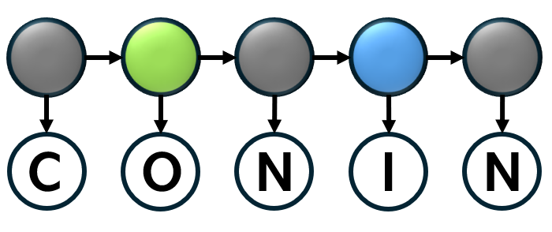

A Python library that supports constrained analysis and learning for probabilistic graphical models.

--------------------------------------------------------------------------------

[](https://github.com/sandialabs/conin/actions/workflows/pytest.yml?query=branch%3Amain)
[](https://codecov.io/gh/sandialabs/conin)
[](https://conin.readthedocs.io/en/latest/)
[](https://github.com/sandialabs/conin/graphs/contributors)
[](https://github.com/sandialabs/conin/pulls?q=is:pr+is:merged)
[](https://github.com/psf/black)

## Overview

Conin supports constrained inference and learning for hidden Markov models, Bayesian networks, dynamic Bayesian networks, and Markov networks. It includes native model classes, reusable constraint declarations, HMM learning utilities, examples, and interfaces to optional backends such as pgmpy, Pyomo-compatible solvers, and Toulbar2.

## Installation

Install Conin from a local checkout with:

```
python -m pip install -e .
```

Optional extras are available for documentation, tests, and PGM integrations:

```
python -m pip install -e .[docs]
python -m pip install -e .[test]
python -m pip install -e .[pgm-all]
```

Individual PGM extras and solver requirements are described in the backend
requirements page in the documentation.

## Documentation

The documentation is published on Read the Docs:

<https://conin.readthedocs.io/en/latest/>

Useful starting points include:

- Quickstart and installation
- Selected examples
- Backend and optional dependency guide
- Model conversion and I/O
- HMM learning

To build the documentation locally:

```
python -m pip install -e .[docs]
python -m sphinx -b html doc doc/_build/html
```

The generated HTML is written to `doc/_build/html`.

## Testing

Conin tests can be executed using pytest:

```
cd conin
pytest .
```

If the pytest-cov package is installed, pytest can provide coverage statistics:

```
cd conin
pytest --cov=conin .
```

The following options list the lines that are missing from coverage tests:
```
cd conin
pytest --cov=conin --cov-report term-missing .
```

Note that pytest coverage includes coverage of test files themselves.  This gives a somewhat skewed sense of coverage for the code base, but it helps identify tests that are omitted or not executed completely.
